# JUnit `@PodLogger` — логи поды в Allure и SQLite

Демонстрация кастомного JUnit 5 extension: на тестовый класс ставится `@PodLogger`. Каждый invocation (в том числе каждый кейс `@ParameterizedTest`) фиксирует UTC-окно, ходит в Kubernetes API через Fabric8 **OpenShiftClient**, парсит JSON-строки лога поды в `PodLogDto` и:

- прикладывает срез в **Allure**;
- сохраняет тот же срез в локальный **SQLite** (`PodStoreService`);
- на **упавшем** invocation читает Kubernetes Events, аттачит непустой список отдельно (`pod-events-*`) и при stand-down Event останавливает оставшиеся тесты класса.

**Один флаг** `collectOnFailOnly` управляет обоими выходами *логов*: что ушло в Allure — то же пишется в store (если под доступна). Events на passed-тесте не снимаются.

Это **не** полноценный OpenShift (CRC/OKD). Локальный кластер демо — **K3s в Docker (Testcontainers)**. API `pods/log` и core/v1 Events те же.

## Документация (канон)

| Документ | Содержание |
| --- | --- |
| [`docs/PodLoggerJunitDemoPRD.md`](docs/PodLoggerJunitDemoPRD.md) | Общий PRD: назначение, модули, слои, инварианты |
| [`docs/PodLoggerJunitDemoTest.md`](docs/PodLoggerJunitDemoTest.md) | Каталог тестов: приёмка, проверка, известные ошибки |
| [`docs/PodLoggerJunitDemoCommands.md`](docs/PodLoggerJunitDemoCommands.md) | Справочник команд по скопам (Test Commands и другие) |
| [`docs/story/PersistentLogStoreStory/PersistentLogStoreStory.md`](docs/story/PersistentLogStoreStory/PersistentLogStoreStory.md) | SQLite store |
| [`docs/story/OpenShiftEventHandlingStory/OpenShiftEventHandlingStory.md`](docs/story/OpenShiftEventHandlingStory/OpenShiftEventHandlingStory.md) | Events, health, fail-fast |
| [`demo-app/demo-app.md`](demo-app/demo-app.md) | SUT: API, JSON-stdout, Docker image |
| [`demo-tests/demo-test.md`](demo-tests/demo-test.md) | K3s/Testcontainers, потребители `@PodLogger` |
| [`junit-pod-logger/junit-pod-logger.md`](junit-pod-logger/junit-pod-logger.md) | Карта модуля и ссылки на пакетные MD рядом с кодом |
| [`k8s/k8s.md`](k8s/k8s.md) | Манифест демо, probes, RBAC |

JavaDoc каждого класса и метода — в модуле `junit-pod-logger`.

Дополнительные архитектурные материалы (не as-built):

- [`docs/story/OpenShiftEventHandlingStory/EventHandlingStrategies.md`](docs/story/OpenShiftEventHandlingStory/EventHandlingStrategies.md) — forward-looking guide по возможной эволюции event management; не заменяет текущий as-built контракт.
- [`docs/story/OpenShiftEventHandlingStory/EventHandling2Story.md`](docs/story/OpenShiftEventHandlingStory/EventHandling2Story.md) — расширенная версия того же guide; использовать как reference для следующей итерации.

## Карта MD-файлов

Эта секция нужна как навигационная карта: от корневого канона и story-документов до модульных и package-level MD. Источник истины по ролям документов остаётся в [`docs/PodLoggerJunitDemoPRD.md`](docs/PodLoggerJunitDemoPRD.md) и в [`docs/PodLoggerJunitDemoDocsCodeAllighment.md`](docs/PodLoggerJunitDemoDocsCodeAllighment.md).

```mermaid
flowchart TD
    readme["README.md"]
    prd["docs/PodLoggerJunitDemoPRD.md"]
    testDoc["docs/PodLoggerJunitDemoTest.md"]
    commandsDoc["docs/PodLoggerJunitDemoCommands.md"]
    snapshot["docs/PodLoggerJunitDemoDocsCodeAllighment.md"]

    storeStory["docs/story/PersistentLogStoreStory/PersistentLogStoreStory.md"]
    eventStory["docs/story/OpenShiftEventHandlingStory/OpenShiftEventHandlingStory.md"]
    strategyRef["docs/story/OpenShiftEventHandlingStory/EventHandlingStrategies.md"]
    eventRef["docs/story/OpenShiftEventHandlingStory/EventHandling2Story.md"]
    alignStory["docs/story/DocsCodeAllighmentStory/DocsCodeAllighmentStory.md"]

    demoApp["demo-app/demo-app.md"]
    demoTests["demo-tests/demo-test.md"]
    library["junit-pod-logger/junit-pod-logger.md"]
    k8sDoc["k8s/k8s.md"]

    rootPkg["junit-pod-logger/.../podLogger.md"]
    clientPkg["junit-pod-logger/.../client/openshiftClient.md"]
    parserPkg["junit-pod-logger/.../parser/logParser.md"]
    storePkg["junit-pod-logger/.../store/store.md"]
    repoPkg["junit-pod-logger/.../store/repository/repository.md"]
    sqlitePkg["junit-pod-logger/.../store/sqlite/sqlLite.md"]
    allurePkg["junit-pod-logger/.../allure/allure.md"]
    eventPkg["junit-pod-logger/.../event/event.md"]

    readme --> prd
    readme --> testDoc
    readme --> commandsDoc
    readme --> snapshot
    prd --> storeStory
    prd --> eventStory
    prd --> demoApp
    prd --> demoTests
    prd --> library
    prd --> k8sDoc
    library --> rootPkg
    library --> clientPkg
    library --> parserPkg
    library --> storePkg
    library --> repoPkg
    library --> sqlitePkg
    library --> allurePkg
    library --> eventPkg
    readme --> strategyRef
    readme --> eventRef
    readme --> alignStory
```



<details open>
<summary><strong>Уровень 1. Корневой канон</strong></summary>

- [`README.md`](README.md) — единая точка входа, run flow, модульный обзор, Jenkins, навигация по MD.
- [`docs/PodLoggerJunitDemoPRD.md`](docs/PodLoggerJunitDemoPRD.md) — главный устав проекта и симметрия документов.
- [`docs/PodLoggerJunitDemoTest.md`](docs/PodLoggerJunitDemoTest.md) — глобальный каталог тестов, критерии приёмки и проверки.
- [`docs/PodLoggerJunitDemoCommands.md`](docs/PodLoggerJunitDemoCommands.md) — reusable команды по скопам.
- [`docs/PodLoggerJunitDemoDocsCodeAllighment.md`](docs/PodLoggerJunitDemoDocsCodeAllighment.md) — snapshot согласованности docs↔code, не поведенческий устав.

</details>

<details>
<summary><strong>Уровень 2. Story-документы</strong></summary>

<details open>
<summary><strong>As-built canon</strong></summary>

- [`docs/story/PersistentLogStoreStory/PersistentLogStoreStory.md`](docs/story/PersistentLogStoreStory/PersistentLogStoreStory.md) — устав persistent store и SQLite.
- [`docs/story/OpenShiftEventHandlingStory/OpenShiftEventHandlingStory.md`](docs/story/OpenShiftEventHandlingStory/OpenShiftEventHandlingStory.md) — lifecycle Events, health, fail-fast, `relevantEvents`.

</details>

<details>
<summary><strong>Reference / target-state / meta</strong></summary>

- [`docs/story/OpenShiftEventHandlingStory/EventHandlingStrategies.md`](docs/story/OpenShiftEventHandlingStory/EventHandlingStrategies.md) — reference, не as-built canon.
- [`docs/story/OpenShiftEventHandlingStory/EventHandling2Story.md`](docs/story/OpenShiftEventHandlingStory/EventHandling2Story.md) — расширенный target-state reference, не as-built canon.
- [`docs/story/DocsCodeAllighmentStory/DocsCodeAllighmentStory.md`](docs/story/DocsCodeAllighmentStory/DocsCodeAllighmentStory.md) — story для skill `docs-code-alignment`, не runtime-контракт приложения.

</details>

</details>

<details>
<summary><strong>Уровень 3. Карты модулей</strong></summary>

- [`demo-app/demo-app.md`](demo-app/demo-app.md) — контракт SUT, logback, Docker image, jar.
- [`demo-tests/demo-test.md`](demo-tests/demo-test.md) — K3s/Testcontainers, consumer-side wiring, почему `OrderErrorIT` красный.
- [`junit-pod-logger/junit-pod-logger.md`](junit-pod-logger/junit-pod-logger.md) — карта переносимой библиотеки и индекс package-level MD.
- [`k8s/k8s.md`](k8s/k8s.md) — manifest, probes, RBAC, копия YAML.

</details>

<details>
<summary><strong>Уровень 4. Package-level карты `junit-pod-logger`</strong></summary>

<details open>
<summary><strong>Корневой пакет `com.example.podlogger`</strong></summary>

- [`junit-pod-logger/src/main/java/com/example/podlogger/podLogger.md`](junit-pod-logger/src/main/java/com/example/podlogger/podLogger.md)

</details>

<details>
<summary><strong>Подпакеты</strong></summary>

- [`junit-pod-logger/src/main/java/com/example/podlogger/client/openshiftClient.md`](junit-pod-logger/src/main/java/com/example/podlogger/client/openshiftClient.md)
- [`junit-pod-logger/src/main/java/com/example/podlogger/parser/logParser.md`](junit-pod-logger/src/main/java/com/example/podlogger/parser/logParser.md)
- [`junit-pod-logger/src/main/java/com/example/podlogger/store/store.md`](junit-pod-logger/src/main/java/com/example/podlogger/store/store.md)
- [`junit-pod-logger/src/main/java/com/example/podlogger/store/repository/repository.md`](junit-pod-logger/src/main/java/com/example/podlogger/store/repository/repository.md)
- [`junit-pod-logger/src/main/java/com/example/podlogger/store/sqlite/sqlLite.md`](junit-pod-logger/src/main/java/com/example/podlogger/store/sqlite/sqlLite.md)
- [`junit-pod-logger/src/main/java/com/example/podlogger/allure/allure.md`](junit-pod-logger/src/main/java/com/example/podlogger/allure/allure.md)
- [`junit-pod-logger/src/main/java/com/example/podlogger/event/event.md`](junit-pod-logger/src/main/java/com/example/podlogger/event/event.md)

</details>

</details>

## Требования

- JDK 17+ (компиляция `release=17`; прогон на JDK 21 допустим)
- Maven 3.9+
- Docker Desktop (только для `OrderErrorIT` / `InfrastructureLoggingTest` в `demo-tests`)

## Модули

| Модуль | Назначение |
| --- | --- |
| `demo-app` | Spring Boot API: `GET /health`, `GET /api/orders/{code}` — 400 + ERROR JSON в stdout |
| `junit-pod-logger` | `@PodLogger`, extension, runtime-сбор, Allure, **SQLite store**, **Kubernetes Events** |
| `demo-tests` | K3s, деплой поды, RestAssured, 4 падающих параметризованных кейса |

## Как запускать

Сборка и тесты библиотеки **без Docker** (parser + persistent store + Event Handling harness):

```bash
mvn -DskipTests package
mvn -pl junit-pod-logger -am test
```

Приёмка store: [`PersistentLogStoreTest`](junit-pod-logger/src/test/java/com/example/podlogger/store/PersistentLogStoreTest.java) (display name **persistent log store test**).

Приёмка Events: [`OpenshiftEventHandlingTest`](junit-pod-logger/src/test/java/com/example/podlogger/event/OpenshiftEventHandlingTest.java) (сценарии 1–5, кластер не нужен).

Полное демо с подой (нужен Docker Desktop). Сначала пакет `demo-app` (jar для Dockerfile), затем тесты:

```bash
mvn -pl demo-app -am package -DskipTests
docker build -t demo-api:local demo-app
mvn -pl demo-tests -am test
```

`demo-tests` сам соберёт образ `demo-api:local`, если jar уже есть, поднимет K3s, импортирует образ, применит [`k8s/demo-api.yaml`](k8s/demo-api.yaml) (копия в classpath: `demo-tests/src/test/resources/k8s/demo-api.yaml`), сделает port-forward и бьёт в API с хоста.

Четыре invocation **ожидаемо красные**: после проверки HTTP 400 тест вызывает `Assertions.fail(...)`, иначе при `collectOnFailOnly=true` не будет ни Allure-аттача логов, ни строк в SQLite.

Отчёт Allure (plugin `allure-maven` 2.15.0). Prefix `allure:` из корня репозитория часто **не** резолвится; рабочая команда:

```bash
mvn -pl demo-tests io.qameta.allure:allure-maven:2.15.0:report
```

Результаты: `demo-tests/target/allure-results`. На каждый failed кейс (`UNKNOWN_SKU`, `OUT_OF_STOCK`, `PAYMENT_DECLINED`, `USER_BLOCKED`) — аттач `pod-logs-<code>.json` (окно invocation ±2s; соседний кейс может попасть в срез). `pod-events-<code>.json` — **только если** `getEvents(window)` непустой; пустой список не аттачится. В v1 `TestRunStarted` часто попадает только в первый parameterized кейс. `podName` в JSON логов / SQLite часто `null`: парсер stdout его не подставляет.

Полный список команд: [`docs/PodLoggerJunitDemoCommands.md`](docs/PodLoggerJunitDemoCommands.md).

## Аннотация

Фактическое использование в `demo-tests` (`OrderErrorIT`):

```java
@SpringBootTest(classes = DemoTestApplication.class, webEnvironment = SpringBootTest.WebEnvironment.NONE)
@PodLogger(collectOnFailOnly = true)
class OrderErrorIT {
    // ...
}
```

Полный API аннотации:

```java
@PodLogger(collectOnFailOnly = true)   // Allure + SQLite логов только при fail
@PodLogger(collectOnFailOnly = false)  // Allure + SQLite логов после каждого invocation
@PodLogger(
    namespace = "default",
    podLabelSelector = "app=demo-api",
    testRunName = "",
    testSuiteName = "",
    environmentType = EnvironmentType.LOCAL,  // DEV | ST | FT | LOCAL
    serviceType = "",
    publishLifecycleEvents = true,
    failFastOnStandDownEvent = true,
    healthCheckUrl = "",
    standDownEventCodes = {},
    standDownMessagePatterns = {})
```

Пустые строки и пустые массивы в полном примере означают «использовать дефолты библиотеки», а не значения из `OrderErrorIT`.

Отдельного атрибута `persist` нет. Gate логов:

```text
shouldCollect = !collectOnFailOnly || failed
```

На failed CollectGate всегда true. Events читаются **только** на fail; пустой список Events-аттач не создаёт.

`PodLoggerService` в `afterEach`:

1. passed → `attachLogsIfNeeded` (CollectGate) без Events;
2. failed → `getEvents(window)` → `probePodAvailability` → Allure Events если список непустой → логи окна: persist только если под доступна; Allure логов — если под доступна или хвост лога непустой.

Ошибки save/Allure **глотаются** (тест не краснеет из‑за store). Ошибка `startTestRun` в `beforeAll` — **fail-fast** с пошаговым SLF4J-логом.

## Kubernetes Events

Публикуем ровно два lifecycle-Event на прогон (не в stdout поды, не per-test):

| Хук | reason (код) | message |
| --- | --- | --- |
| `beforeAll` после `startTestRun` | `TestRunStarted` | имя прогона, `testRunId`, suite |
| `afterAll` | `TestRunFinished` | имя, `total`, `passed`, `failed` |

Потребление: `getEvents` только на упавшем invocation и внутри `isPodAvailable()`. Stand-down Event (`Maintenance`, `Evicted`, …) → fail-fast оставшихся тестов (`beforeEach` бросает `Stand unavailable: <code>`). Красный HTTP health **без** такого Event прогон не рвёт, но SQLite этого invocation не пишет.

`PodLogDto.relevantEvents` заполняется на fail для Allure JSON; в SQLite поле не хранится.

RBAC (для закрытого контура; тот же YAML в [`k8s/k8s.md`](k8s/k8s.md)):

```yaml
apiVersion: rbac.authorization.k8s.io/v1
kind: Role
metadata:
  name: pod-logger-events
rules:
  - apiGroups: [""]
    resources: ["pods", "pods/log"]
    verbs: ["get", "list"]
  - apiGroups: [""]
    resources: ["events"]
    verbs: ["get", "list", "create"]
```

Без `create`: Started/Finished не появятся, прогон идёт. Без `list`: Events пустые, fail-fast по Event не сработает; k8s Ready всё ещё работает.

## Persistent Log Store (SQLite)

Реализовано в `junit-pod-logger`. Primary store — **один файл SQLite**. Export JSON в v1 нет.

### Файл БД

По умолчанию: `{user.dir}/target/pod-logger-store.sqlite`.

Переопределение (первый найденный выигрывает):

1. system property `pod.logger.store-path`
2. env `POD_LOGGER_STORE_PATH`
3. `PodLoggerProperties.storePath`

Файлы `*.sqlite*` в [`.gitignore`](.gitignore). CI-artifact БД пока не требуется.

### Test run

`PodLoggerExtension`:

- `beforeAll` — `TestRunStore.startTestRun(...)` (`startedAt`), затем publish `TestRunStarted`, затем probe;
- `afterEach` — collect/save/Allure по gate (+ Events на fail);
- `afterAll` — `collectAndMergeLogsForTestRun` + publish `TestRunFinished` + `finishTestRun` (`finishedAt`).

Прогоны `DEV` / `ST` / `FT` / `LOCAL` живут в **одной** базе; различаются `EnvironmentType` и `testRunId` (имя прогона неуникально).

### Публичный API

- `PodStoreService` — save / get по overload-ам и `LogQuery`, `getLogsForWholeRun`, `deleteOlderThan(days)`
- `TestRunStore` — lifecycle и metadata прогона
`PodLogDto` — поля лога из поды **плюс** контекст: `testRunId`, `runName`/`testRunName`, `testSuiteName`, `relatedTestClass`, `relatedTestMethod`, `environmentType`, `serviceType`, `fingerprint`, `relevantEvents` (runtime only). `podName` в log DTO парсер stdout **не** заполняет (остаётся `null`, если его не было в JSON строки).

`deleteOlderThan(days)` считает возраст по `test_run.started_at`, удаляет **закрытый** run и его `log_entry`. Открытые run (`finished_at IS NULL`) не трогает.

`GetUniqueLogs` / `GetRelevantLogs` в v1 **не** реализованы (зарезервирован analysis-слой).

## Jenkins

- [`Jenkinsfile`](Jenkinsfile) — package, `docker build`, тесты `demo-tests` (UNSTABLE из‑за ожидаемых fail), Allure.
- Библиотечные тесты store/events в этом пайплайне отдельно не вызываются; для закрытого контура добавьте `mvn -pl junit-pod-logger -am test`.
- Агент с Maven 17 + docker CLI: [`docker/jenkins/Dockerfile`](docker/jenkins/Dockerfile). Агенту нужен доступ к Docker socket (`/var/run/docker.sock`) для Testcontainers.

## Коды ошибок API

Канон SUT: [`demo-app/demo-app.md`](demo-app/demo-app.md).

| code | message в JSON и в логе поды |
| --- | --- |
| `UNKNOWN_SKU` | Unknown SKU |
| `OUT_OF_STOCK` | Item is out of stock |
| `PAYMENT_DECLINED` | Payment was declined |
| `USER_BLOCKED` | User is blocked |

## Риски миграции

- Главный риск при переносе в другой контур находится не в OpenShift client как таковом, а в границе `pods/log` -> `PodLogDto`: другой JSON stdout, другие имена полей или другой `timestamp` быстро приводят к пустым или частично `null` DTO. Детали: [`junit-pod-logger/src/main/java/com/example/podlogger/parser/logParser.md`](junit-pod-logger/src/main/java/com/example/podlogger/parser/logParser.md).
- Второй слой риска — platform Events, RBAC и probe. Если parser уже адаптирован, fail-fast всё ещё может вести себя иначе из-за `reason`, `message`, `events.k8s.io` или прав на `events`. Детали: [`junit-pod-logger/src/main/java/com/example/podlogger/client/openshiftClient.md`](junit-pod-logger/src/main/java/com/example/podlogger/client/openshiftClient.md), [`junit-pod-logger/src/main/java/com/example/podlogger/event/event.md`](junit-pod-logger/src/main/java/com/example/podlogger/event/event.md), [`k8s/k8s.md`](k8s/k8s.md).
- SQLite в вашем сценарии обычно не первичный риск: библиотека хранит только свои опубликованные поля. Риск опосредован тем, какие поля пришли из parser/client и что попало в `PodLogDto`. Детали: [`junit-pod-logger/src/main/java/com/example/podlogger/store/store.md`](junit-pod-logger/src/main/java/com/example/podlogger/store/store.md), [`junit-pod-logger/src/main/java/com/example/podlogger/store/sqlite/sqlLite.md`](junit-pod-logger/src/main/java/com/example/podlogger/store/sqlite/sqlLite.md).
- Для быстрой адаптации включайте `DEBUG` на `com.example.podlogger` и `com.example.demotest`, затем идите по step-level логам `PodLogger beforeAll/afterEach/afterAll` и `ClusterLifecycle.start step=...`. Команда есть в [`docs/PodLoggerJunitDemoCommands.md`](docs/PodLoggerJunitDemoCommands.md).
