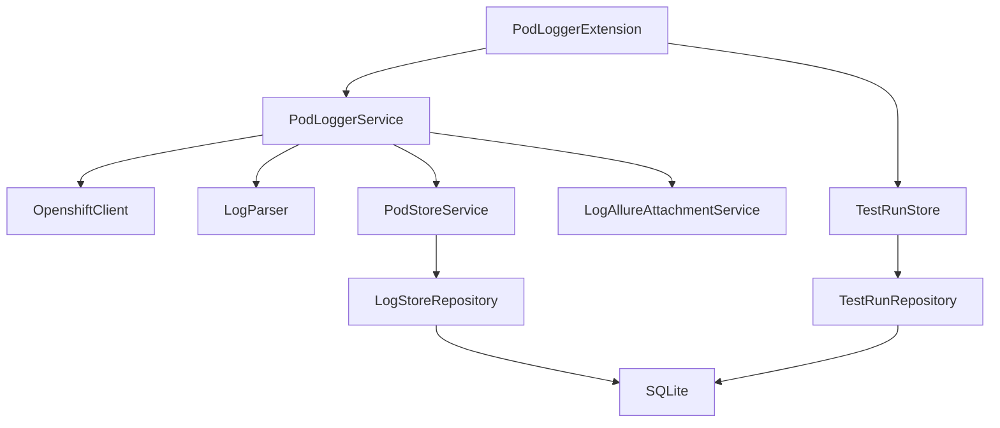
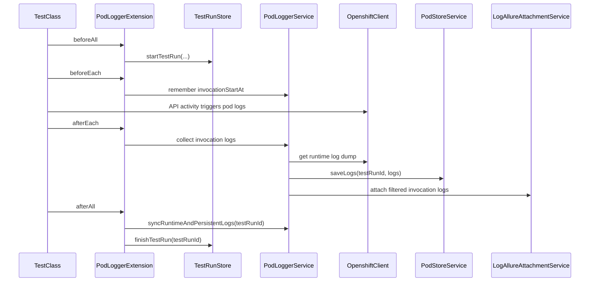

# PRD: Persistent Pod Log Store для `@PodLogger`

## 1. Цель

Расширить существующий demo-проект `pod-logger-junit-demo` persistent-слоем для pod logs, не ломая текущий runtime-flow:

1. сохранять распарсенные pod logs текущего и прошлых тестовых прогонов;
2. хранить контекст test run и test suite;
3. искать логи по времени, test run, suite, environment и service type;
4. получать логи как по одному invocation, так и по всему окну `BeforeAll -> AfterAll`;
5. сохранить текущую интеграцию с Allure для runtime-аттачей;
6. подготовить архитектуру под дальнейшие `GetUniqueLogs` и `GetRelevantLogs`.

Базовое локальное persistent storage первой версии: `SQLite`.

## 2. Текущая фактическая структура

PRD опирается на существующие классы и модули проекта:

- [`pom.xml`](c:\Users\V\pod-logger-junit-demo\pom.xml) — parent Maven project с модулями `demo-app`, `junit-pod-logger`, `demo-tests`.
- [`junit-pod-logger/src/main/java/com/example/podlogger/PodLoggerExtension.java`](c:\Users\V\pod-logger-junit-demo\junit-pod-logger\src\main\java\com\example\podlogger\PodLoggerExtension.java) — фиксирует start time invocation в `ExtensionContext.Store`, вызывает `PodLoggerService` из `beforeEach/afterEach`.
- [`junit-pod-logger/src/main/java/com/example/podlogger/PodLoggerService.java`](c:\Users\V\pod-logger-junit-demo\junit-pod-logger\src\main\java\com\example\podlogger\PodLoggerService.java) — получает pod logs, фильтрует их по времени, прикладывает JSON к Allure.
- [`junit-pod-logger/src/main/java/com/example/podlogger/client/OpenshiftClient.java`](c:\Users\V\pod-logger-junit-demo\junit-pod-logger\src\main\java\com\example\podlogger\client\OpenshiftClient.java) — ходит в Kubernetes/OpenShift API и inline-парсит JSON log lines.
- [`junit-pod-logger/src/main/java/com/example/podlogger/client/PodLogDto.java`](c:\Users\V\pod-logger-junit-demo\junit-pod-logger\src\main\java\com\example\podlogger\client\PodLogDto.java) — текущий DTO с полями `timestamp`, `level`, `message`, `logger`.
- [`demo-tests/src/test/java/com/example/demotest/ClusterLifecycle.java`](c:\Users\V\pod-logger-junit-demo\demo-tests\src\test\java\com\example\demotest\ClusterLifecycle.java) — lifecycle K3s, port-forward и runtime OpenShiftClient.
- [`README.md`](c:\Users\V\pod-logger-junit-demo\README.md) — описание работающего runtime demo.

## 3. Проблема

Сейчас система умеет:

- получить runtime logs из поды;
- выделить окно для конкретного тестового invocation;
- приложить windowed log slice к Allure.

Сейчас система не умеет:

- сохранять логи между прогонами;
- фиксировать единый `test run`;
- искать historical logs по множеству фильтров;
- сопоставлять логи между разными стендами `DEV`, `ST`, `FT`.

## 4. Ключевое архитектурное решение

Сохраняем текущие имена и обязанности публичных runtime-компонентов:

- `PodLoggerExtension`
- `PodLoggerService`
- `PodLogDto`
- `OpenshiftClient`

И добавляем новый слой `com.example.podlogger.store`, который отвечает только за persistent model и query API.



Главный принцип:

- runtime collection живёт в `PodLoggerService` и `OpenshiftClient`;
- persistence/query живут в `PodStoreService` и repository;
- orchestration lifecycle живёт в `PodLoggerExtension`;
- Allure остаётся отдельным output layer.

## 5. Целевая package structure

Новые классы добавляются в модуль [`junit-pod-logger`](c:\Users\V\pod-logger-junit-demo\junit-pod-logger):

```text
com.example.podlogger
├── PodLogger
├── PodLoggerExtension
├── PodLoggerService
├── PodLoggerProperties
├── PodLoggerConfiguration
├── client
│   ├── OpenshiftClient
│   └── PodLogDto
├── parser
│   └── LogParser
├── allure
│   └── LogAllureAttachmentService
└── store
    ├── EnvironmentType
    ├── PodStoreService
    ├── TestRunStore
    ├── LogStoreRepository
    ├── TestRunRepository
    ├── SqliteLogStoreRepository
    ├── SqliteTestRunRepository
    └── dto
        ├── LogQuery
        └── TestRunDto
```

## 6. Ответственность компонентов

### `PodLoggerExtension`

Отвечает за lifecycle test class и test invocation:

- `BeforeAll` / `AfterAll` для `test run`;
- `BeforeEach` / `AfterEach` для invocation window;
- создание и завершение test run;
- передача control flow в `PodLoggerService`.

В `PodLoggerExtension` не должно быть:

- SQL;
- repository-кода;
- работы с SQLite schema;
- логики парсинга log dump.

### `PodLoggerService`

Отвечает за orchestration:

- получить runtime logs через `OpenshiftClient`;
- распарсить raw dump через `LogParser`;
- отфильтровать runtime logs по test window или run window;
- сохранить нужные данные в `PodStoreService`;
- отправить attach в `LogAllureAttachmentService`.

В `PodLoggerService` не должно быть:

- SQL;
- query builder для historical search;
- schema migration logic.

### `PodStoreService`

Публичный application service над persistent log store:

- сохраняет `PodLogDto`;
- получает `PodLogDto` из persistent layer;
- отдаёт query-ориентированный API;
- скрывает детали repository.

### `TestRunStore`

Отвечает за model и lifecycle test run:

- старт прогона;
- завершение прогона;
- чтение metadata прогона;
- получение run-level временного окна.

### `OpenshiftClient`

Остаётся runtime gateway к K8s/OpenShift API:

- находит целевую pod;
- забирает raw log dump;
- не знает о БД и historical queries.

### `LogParser`

Отдельный parser-компонент:

- `String raw` -> `List<PodLogDto>`;
- не знает ни о JUnit, ни об Allure, ни о SQLite.

### `LogAllureAttachmentService`

Отдельный output service:

- сериализует logs в attachment;
- прикладывает result к Allure;
- не выполняет persistence.

## 7. Публичный API `PodStoreService`

Первая версия должна поддержать публичные методы:

```java
public interface PodStoreService {

    void saveLogs(List<PodLogDto> logs);

    void saveLogs(UUID testRunId, List<PodLogDto> logs);

    List<PodLogDto> getLogs();

    List<PodLogDto> getLogs(UUID testRunId);

    List<PodLogDto> getLogs(LocalDateTime from, LocalDateTime to);

    List<PodLogDto> getLogs(
        LocalDateTime from,
        LocalDateTime to,
        EnvironmentType environmentType
    );

    List<PodLogDto> getLogs(
        String testSuiteName,
        EnvironmentType environmentType
    );

    List<PodLogDto> getLogs(
        String testRunName,
        String testSuiteName,
        EnvironmentType environmentType
    );

    List<PodLogDto> getLogs(LogQuery query);

    List<PodLogDto> getLogsForWholeRun(UUID testRunId);

    List<PodLogDto> syncRuntimeAndPersistentLogs(UUID testRunId);
}
```

Примечание:

- overload-методы допустимы как переходный business API;
- целевой расширяемый контракт для роста фильтров: `List<PodLogDto> getLogs(LogQuery query)`.

## 8. Публичный API `TestRunStore`

```java
public interface TestRunStore {

    UUID startTestRun(
        String testRunName,
        String testSuiteName,
        EnvironmentType environmentType
    );

    void finishTestRun(UUID testRunId);

    Optional<TestRunDto> getTestRun(UUID testRunId);

    Optional<TestRunDto> getTestRun(String testRunName);

    List<TestRunDto> getTestRuns(LocalDateTime from, LocalDateTime to);

    List<PodLogDto> getRunWindowLogs(UUID testRunId);
}
```

`getRunWindowLogs(UUID testRunId)` нужен для сценария, когда требуется единое большое окно между `BeforeAll` и `AfterAll`.

## 9. DTO и enum модели

### `PodLogDto`

Существующий [`PodLogDto.java`](c:\Users\V\pod-logger-junit-demo\junit-pod-logger\src\main\java\com\example\podlogger\client\PodLogDto.java) должен быть расширен до следующего контракта:

```java
public class PodLogDto {

    private UUID id;
    private UUID testRunId;
    private String testRunName;
    private String testSuiteName;
    private EnvironmentType environmentType;
    private String serviceType;
    private LocalDateTime timestamp;
    private String level;
    private String logger;
    private String message;
    private String stackTrace;
    private String podName;
    private String namespace;
}
```

Обязательная причина для `testRunId`: `testRunName` может повторяться между прогонами, а `UUID` однозначно идентифицирует конкретный run.

### `TestRunDto`

```java
public class TestRunDto {

    private UUID id;
    private String testRunName;
    private String testSuiteName;
    private EnvironmentType environmentType;
    private LocalDateTime startedAt;
    private LocalDateTime finishedAt;
}
```

### `EnvironmentType`

```java
public enum EnvironmentType {
    DEV,
    ST,
    FT
}
```

### `LogQuery`

```java
public class LogQuery {

    private UUID testRunId;
    private String testRunName;
    private String testSuiteName;
    private EnvironmentType environmentType;
    private String serviceType;
    private LocalDateTime from;
    private LocalDateTime to;
    private String level;
    private String logger;
    private String messageContains;
}
```

## 10. Lifecycle и взаимосвязи

Текущее поведение [`PodLoggerExtension.java`](c:\Users\V\pod-logger-junit-demo\junit-pod-logger\src\main\java\com\example\podlogger\PodLoggerExtension.java) должно быть расширено.

### Invocation-level lifecycle

- `beforeEach` фиксирует `invocationStartAt`;
- `afterEach` фиксирует `invocationEndAt`;
- `PodLoggerService` получает runtime logs, фильтрует по окну invocation и при необходимости делает Allure attach;
- эти же logs могут сохраняться в persistent store с привязкой к `testRunId`.

### Run-level lifecycle

- `BeforeAll` создаёт `testRunId`, `startedAt`, `testRunName`, `testSuiteName`, `environmentType`;
- `AfterAll` получает `finishedAt`;
- после этого выполняется финальная `syncRuntimeAndPersistentLogs(testRunId)` для длинного run-level окна.



Система должна различать два интервала:

- `invocation window` — один кейс `@ParameterizedTest`;
- `run window` — весь test class / suite.

## 11. Runtime и persistent retrieval

PRD должен жёстко разделять два типа получения логов.

### Runtime collection

В `PodLoggerService`:

```java
List<PodLogDto> collectLogsForInvocation(...);
List<PodLogDto> collectLogsForRun(UUID testRunId);
```

Эти методы:

1. получают runtime logs из `OpenshiftClient`;
2. вызывают `LogParser`;
3. фильтруют по окну;
4. сохраняют результат в `PodStoreService`;
5. при необходимости прикладывают result в Allure.

### Persistent retrieval

В `PodStoreService`:

```java
List<PodLogDto> getLogs(UUID testRunId);
List<PodLogDto> getLogs(LogQuery query);
List<PodLogDto> getLogsForWholeRun(UUID testRunId);
```

`PodStoreService` не должен знать про Kubernetes API, HTTP, pod discovery и raw log parsing.

## 12. Persistent model

Нормализованная схема первой версии:

```text
test_run
id
test_run_name
test_suite_name
environment_type
started_at
finished_at

log_entry
id
test_run_id
service_type
timestamp
level
logger
message
stack_trace
pod_name
namespace
fingerprint
```

### Базовый SQL-эскиз

```sql
CREATE TABLE test_run (
    id TEXT PRIMARY KEY,
    test_run_name TEXT NOT NULL,
    test_suite_name TEXT,
    environment_type TEXT NOT NULL,
    started_at TEXT NOT NULL,
    finished_at TEXT
);

CREATE TABLE log_entry (
    id TEXT PRIMARY KEY,
    test_run_id TEXT NOT NULL,
    service_type TEXT,
    timestamp TEXT NOT NULL,
    level TEXT,
    logger TEXT,
    message TEXT,
    stack_trace TEXT,
    pod_name TEXT,
    namespace TEXT,
    fingerprint TEXT,
    FOREIGN KEY (test_run_id) REFERENCES test_run(id)
);
```

### Индексы

```sql
CREATE INDEX idx_log_test_run ON log_entry(test_run_id);
CREATE INDEX idx_log_timestamp ON log_entry(timestamp);
CREATE INDEX idx_log_service_type ON log_entry(service_type);
CREATE INDEX idx_log_level ON log_entry(level);
CREATE INDEX idx_test_run_environment ON test_run(environment_type);
```

`testRunName` и `testSuiteName` можно нормализовать в `test_run`, а в DTO восстанавливать на этапе mapping.

## 13. Неграницы ответственности

В `PodStoreService` не должно находиться:

- `getLogsFromPod()`;
- HTTP/Kubernetes calls;
- parsing raw log string;
- Allure attachment logic;
- test lifecycle orchestration;
- log analytics `unique` / `relevant`.

Это важно, чтобы persistent store остался простым и расширяемым API слоя хранения.

## 14. Будущие расширения

Функции `GetUniqueLogs` и `GetRelevantLogs` не входят в первую фазу store-layer и должны проектироваться отдельным слоем:

```java
public interface LogAnalysisService {

    List<PodLogDto> getUniqueLogs(UUID testRunId);

    List<PodLogDto> getUniqueLogs(LocalDateTime from, LocalDateTime to);

    List<PodLogDto> getRelevantLogs(UUID testRunId);
}
```

Этот слой работает поверх `PodStoreService`, а не поверх `OpenshiftClient`.

## 15. Изменения в документации

### Обновление `README.md`

В [`README.md`](c:\Users\V\pod-logger-junit-demo\README.md) нужно отразить:

1. что текущий проект уже умеет runtime pod log attachments в Allure;
2. что persistent pod log store является следующим архитектурным этапом;
3. где располагается SQLite база локально;
4. какие фильтры появятся в `PodStoreService`;
5. чем отличаются per-test attachments и historical queries;
6. как используются `EnvironmentType` и `serviceType`.

### Обновление `docs/prd`

В [`docs/prd/podLoggerJunitDemoPRD.md`](c:\Users\V\pod-logger-junit-demo\docs\prd\podLoggerJunitDemoPRD.md) должны быть:

1. фактическая текущая структура проекта;
2. новая target architecture;
3. public API `PodStoreService` и `TestRunStore`;
4. updated DTO contract;
5. invocation/run lifecycle diagrams;
6. acceptance criteria;
7. порядок внедрения.

При необходимости может появиться отдельный design doc, например `docs/store/pod-log-store-design.md`.

## 16. Acceptance criteria

PRD считается полным и непротиворечивым, если:

1. он опирается на реальные существующие классы `PodLoggerExtension`, `PodLoggerService`, `OpenshiftClient`, `PodLogDto`;
2. `PodStoreService` описан как отдельный persistent application service;
3. `TestRunStore` описывает полный lifecycle `BeforeAll -> AfterAll`;
4. `PodLogDto` расширен полями `testRunName`, `testSuiteName`, `environmentType`, `serviceType` и `testRunId`;
5. есть явное разделение между runtime collection и persistent retrieval;
6. описана нормализованная SQLite schema;
7. обновления `README.md` и `docs/prd` перечислены как обязательные deliverables;
8. PRD не утверждает, что persistent layer уже реализован в коде, если его ещё нет.

## 17. Порядок реализации

Рекомендуемый порядок внедрения:

1. расширить `PodLogDto`, добавить `EnvironmentType`, `TestRunDto`, `LogQuery`;
2. вынести `LogParser` из `OpenshiftClient`;
3. ввести `PodStoreService` и repository abstractions;
4. добавить `TestRunStore` и run-level lifecycle в `PodLoggerExtension`;
5. подключить SQLite и schema initialization;
6. обновить orchestration в `PodLoggerService`;
7. вынести Allure attachment в отдельный service;
8. обновить `README.md` и `docs/prd`;
9. после стабилизации store-layer спроектировать `LogAnalysisService`.
